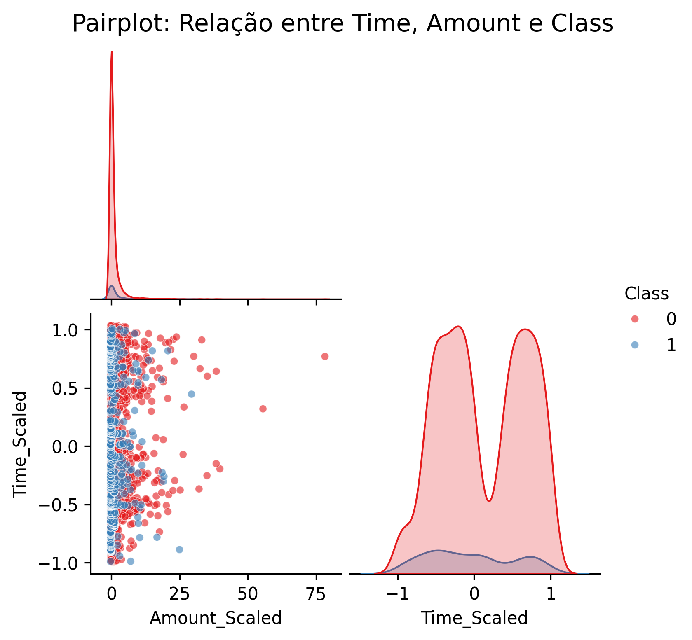
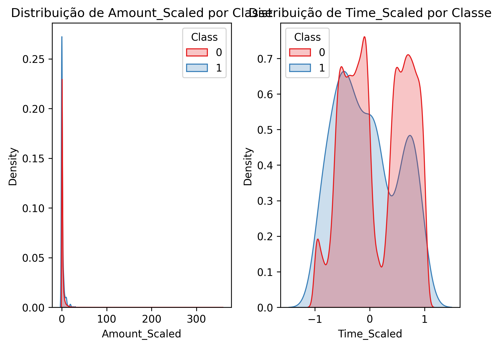
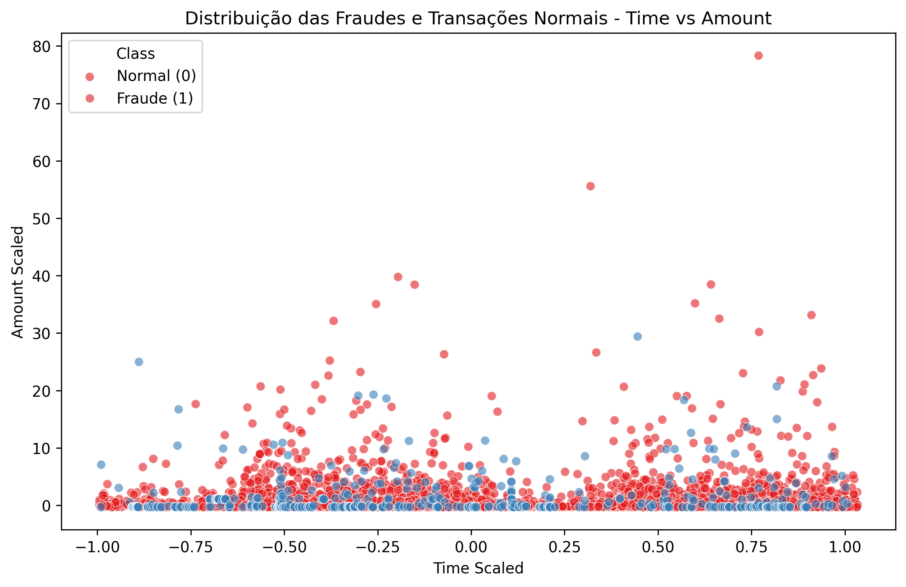
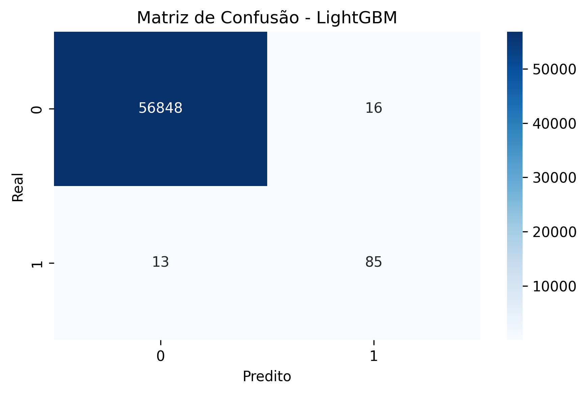

# 🕵️ Detecção de Fraudes em Transações Financeiras

Este projeto tem como objetivo desenvolver um modelo de machine learning para **detecção de fraudes** em transações financeiras, utilizando técnicas de pré-processamento, balanceamento de classes, validação cruzada, tuning de hiperparâmetros e calibração de probabilidades.

---

## 📁 Estrutura do Projeto

- `Projeto_Final.ipynb`: Notebook completo com todos os passos do projeto
- `README.md`: Documentação do projeto
- `img/`: Pasta com visualizações salvas (gráficos gerados durante a análise)

---

## 📂 Base de Dados

A base utilizada neste projeto está disponível publicamente no Google Drive:

📥 [Clique aqui para baixar o dataset (CSV)](https://drive.google.com/file/d/1xkM3LcbbQOfu3T_3U41siVD_f5JBWJc_/view?usp=drive_link)

Após o download, salve o arquivo com o nome exato:

```
Base_M43_Pratique_CREDIT_CARD_FRAUD.csv
```

📌 Coloque o arquivo **na mesma pasta do notebook** para garantir que o `read_csv()` funcione corretamente.

---

## 🚀 Tecnologias e Bibliotecas Utilizadas

- Python 3.x
- Pandas, NumPy
- Scikit-learn
- LightGBM, XGBoost, RandomForest
- Imbalanced-learn (SMOTE)
- Matplotlib, Seaborn
- CalibratedClassifierCV
- RandomizedSearchCV

---

## 🔄 Pipeline de Modelagem

1. **Leitura e análise exploratória**
2. **Criação de variáveis escaladas:** `Amount_Scaled`, `Time_Scaled`
3. **Balanceamento com SMOTE (0.2)**
4. **Treinamento com 3 algoritmos:**
   - RandomForest, XGBoost, LightGBM
5. **Tuning com RandomizedSearchCV**
6. **Validação cruzada (3 folds) com F1-score**
7. **Calibração com CalibratedClassifierCV**
8. **Avaliação com métricas e gráficos:**
   - Matriz de confusão
   - Classification report
   - Curva ROC
   - Gráficos de densidade e dispersão

---

## 📈 Resultados

### 🔹 F1-score médio por modelo (validação cruzada):

| Modelo       | F1-score médio |
|--------------|----------------|
| **LightGBM** | **0.9991**     |
| XGBoost      | 0.9989         |
| RandomForest | 0.9959         |

- O **LightGBM** apresentou o melhor equilíbrio entre desempenho e custo computacional.
- Tempo de execução:
  - LightGBM ≈ 13 minutos
  - XGBoost ≈ 1h30min

---

## 📊 Exemplos de visualizações

A seguir, algumas das visualizações geradas para explorar os dados e validar o desempenho do modelo:

- **Pairplot:**
  

- **Distribuição KDE:**
  

- **Scatterplot Time vs Amount:**
  

- **Matriz de Confusão:**
  

- **Curva ROC:**
  

---

## ✅ Conclusão

O modelo final baseado em **LightGBM** mostrou-se extremamente eficaz na detecção de fraudes, com um F1-score médio de **0.999** e performance consistente entre os folds.  
Além disso, o tempo de execução foi altamente vantajoso em comparação ao XGBoost, e a calibração de probabilidades garantiu um modelo mais confiável em suas previsões — essencial para aplicações críticas como esta.

---

## 👨‍💻 Autor

**Lucas Sugahara**  
📧 [lucassugahara.trabalho@gmail.com](mailto:lucassugahara.trabalho@gmail.com)  
💼 [LinkedIn](https://www.linkedin.com/in/lucas-sugahara-767739352)

---

## 🛠️ Como rodar este projeto

1. Clone o repositório:

```bash
git clone https://github.com/Sugaharaa/fraud-detection.git
```

2. Instale as dependências:

```bash
pip install pandas numpy scikit-learn lightgbm xgboost imbalanced-learn matplotlib seaborn
```

3. Coloque o arquivo `.csv` baixado na mesma pasta do notebook.

4. Execute o notebook `Projeto_Final.ipynb` no Jupyter ou Colab.

---

⭐ Se este projeto te ajudou ou inspirou, deixe uma estrela no repositório!
